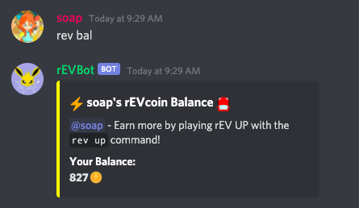
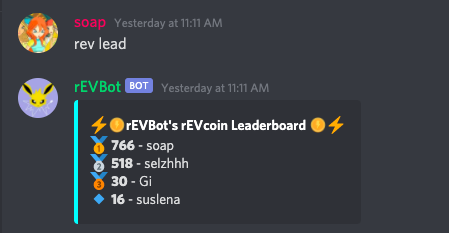

# rEVBot 🤖

## Invite rEVBot to your server [here](https://discord.com/api/oauth2/authorize?client_id=812549585632362506&permissions=339008&scope=bot) 🚗

Prefered if you don't run your own instance of the bot, use the join link above instead.

## 🛠 What's rEVBot?
rEVBot is a multipurpose Discord bot made to decrease the disconnect between teenagers and their peers while serving as a fun and environmentally educational medium. Written using Discord.py API and Firestore DB, it features an entertaining mini-game that spreads awareness and dispels misconceptions about electric vehicles, a leaderboard where users can engage in friendly competition against each other, and a “safe space” function that assigns coin penalties to the authors of insensitive messages!

🔌 You can add rEVBot to your own Discord server through this [link](https://discord.com/api/oauth2/authorize?client_id=812549585632362506&permissions=339008&scope=bot). Simply type `rev help`, and have fun with our features!

Community server to try out the bot for yourself or to get support:
https://discord.gg/HCqwgU5YFN

## 🌱 How we built it 
Our project is built using Python, discord.py, and Google Cloud Firestore. We built the bot with the discord.py library to connect it with the Discord API and used it to run our different features, including:

`rev help`: Full list of bot commands.

`rev up`: A minigame where users need to react to rEVBot’s message and navigate their EV to dodge obstacles and collect rEVcoins. Should the user hit an obstacle, they will need to answer an EV-related question in order to continue.

After hitting an obstacle:

`rev bal`: Check user’s personal balance, stored in Firestore.

`rev lead`: Shows the top rEVcoin users in the server.

## 🤖 What's next for rEVBot 
As a team, we’ve invested so much time into figuring out how to make rEVBot work, so we’re definitely going to be continuing to develop and hopefully launch it in the near future. With our MVP completed, our goals include:
1. Creating a website to make rEVBot accessible and easy to download.
2. Soft-launch to market to get a small beta user-base.
3. Update rEVBot based on user feedback and implement more advanced functions, including 24/7 functionality.
