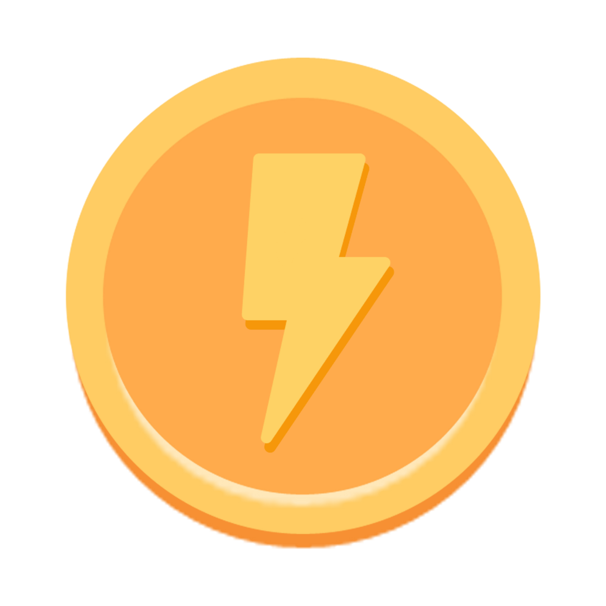

# rEVBot
<a href="url">

## 🌟 Inspiration
As a result of the pandemic, teenagers and young adults have been unable to interact with each other in a safe and meaningful way. Humans need social interaction, but lately it’s been really hard to get that. Forty per cent of Canadians in general reported that their mental health has gotten worse in a recent survey done by the Canadian Mental Health Association. Especially with youth, it’s more important than ever to connect with each other in safe and nurturing virtual environments. On the other hand, environmental issues have become an increasingly important topic with the younger generation. EVs are an area with high untapped potential - in fact, electric vehicles made up only 0.2 percent of the total Canadian vehicle population in 2018. As a highly innovative and environmentally friendly technology, it’s more important than ever to spread awareness about EVs to a generation of environmentally passionate youth.

## 🛠 What's rEVBot?
rEVBot is a multipurpose Discord bot made to decrease the disconnect between teenagers and their peers while serving as a fun and environmentally educational medium. Written using Discord.py API and Firestore DB, it features an entertaining mini-game that spreads awareness and dispels misconceptions about electric vehicles, a leaderboard where users can engage in friendly competition against each other, a “safe space” function that replaces sensitive messages with facts about EVs, and more!

🔌 You can add rEVBot to your own Discord server through this [link](https://discord.com/api/oauth2/authorize?client_id=812549585632362506&permissions=8&scope=bot). Simply type `rev help`, and have fun with our features!

## 🌱 How we built it 
Our project is built using Python, discord.py, and Google Cloud Firestore. We built the bot with the discord.py library to connect it with the Discord API and used it to run our different features, including:

`rev help`: Full list of bot commands.

`rev up`: A minigame where users need to react to rEVBot’s message and navigate their EV to dodge obstacles and collect rEVcoins. Should the user hit an obstacle, they will need to answer an EV-related question in order to continue.

`rev bal`: Check user’s personal balance, stored in Firestore.

`rev lead`: Shows the top rEVcoin users in the server.

## 🌎 Why did we build it? 
From personal experience and speaking with friends, we found that while COVID-19 is rampant, a near unstoppable pandemic we are all facing is one of loneliness and stress stemming from a forced disconnect from the outside world. It is very difficult for us to stay motivated when our actions seem to have no impact, and it feels as though we are completely alone. Like many other small hobbies, the rev up minigame is low-skill and accessible. It provides a small, tangible goal for us to focus on, while not limiting those without resources or natural talent. rev up also serves to promote connectivity through digital and distanced means. Like us, our adolescent audience already regularly uses Discord to connect with others all over the world through common interests, and rEV UP functions through the rEV Bot that is added to Discord servers. rEV UP is thus conveniently available for many, and serves as a guaranteed motivator for online socialising. Sometimes, finding the words to converse with others consumes more energy than we have, and simply the presence and proof that our friends are actively working on something, no matter how trivial, brings comfort and encouragement. 

While being a tool to connect, rEV UP also promotes electric vehicles and debunks common misconceptions. Games are known for their competitive addictiveness and repetition; they are reliable for drilling facts and information to the generation of youth who are nearing independence and adulthood. Us as a generation already feel the need to become more eco-friendly, but are often taught of the barriers. With the information from this game, we will likely go electric as our perception and experience of the technology has been made positive. Education provides near permanent, long-run benefits and can be passed onto future generations to better care for our earth.

## 💬 What we learned 
As avid Discord users ourselves, we love using Discord bots like Dank-memer or carl-bot. We learned a lot about ourselves, coding, and Discord bots during these 36 hours, including:
- Sometimes, it's easier to structure your code first! Otherwise you end up with functions all over the place (we're guilty of this!).
- Even when something seems futile, we can believe in our coding abilities. After spending almost 2 hours straight debugging a part of our minigame, it felt so good being able to say "it works!!"

## 🤖 What's next for rEVBot 
As a team, we’ve invested so much time into figuring out how to make rEVBot work, so we’re definitely going to be continuing to develop and hopefully launch it in the near future. With our MVP completed, our goals include:
1. Creating a website to make rEVBot accessible and easy to download.
2. Soft-launch to market to get a small beta user-base.
3. Update rEVBot based on user feedback and implement more advanced functions, including 24/7 functionality.

